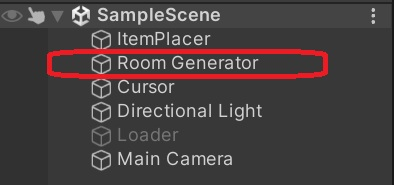
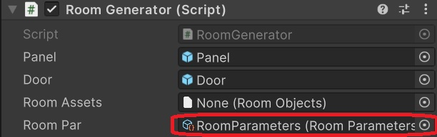
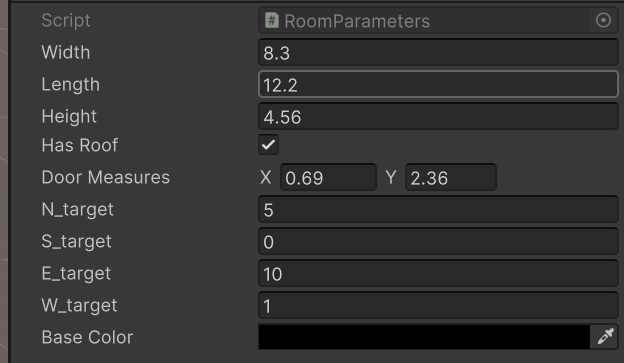
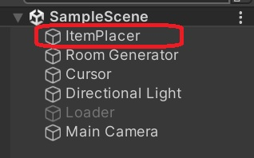
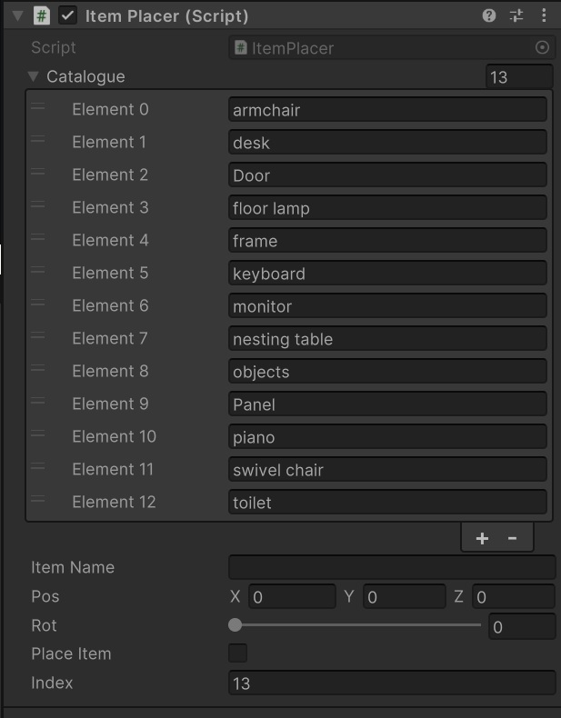
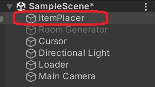

# GAEV

Este proyecto facilita la generación de habitaciones de forma sencilla mediante la especificación de sus parámetros, permitiendo posteriormente guardar la configuración en un archivo `.json` y cargar la habitación generada a partir de dicho archivo.


---
Autores: Jonás Rodríguez Unanyan y Maria Laura Hernández Hernández
## 📚 Índice

- [Instalación](#instalación)
- [Uso](#uso)
- [Estructura](#estructura)

---


## 📦 Instalación

1. Clona el repositorio:
   ```bash
   git clone https://github.com/Jonas-RUnanyan/GAEV.git
   ```
2. Abre Unity Hub.

3. Selecciona "Add" y busca la carpeta del proyecto.

4. Asegúrate de abrirlo con la versión correcta de Unity (2022.3.30f1)

---

## 🧪 Uso

Para comenzar, asegúrate de que el objeto `RoomGenerator` esté **activo** y que el objeto `RoomLoader` esté **inactivo**. Puedes cambiar su estado con clic derecho > *Toggle Active State* en el panel de jerarquía de Unity.



Ejecuta la escena con el botón *Play*. Los controles de la cámara son los siguientes:
- **WASD** para desplazarse.
- **Clic medio + arrastrar** para mover la vista.

En el inspector de `RoomGenerator`, ubica el componente **Room Par** y haz doble clic sobre `RoomParameters` para acceder al objeto que contiene los parámetros de configuración de la habitación.



Allí podrás definir:
- **Dimensiones**: altura, anchura y profundidad de la habitación.
- **Tejado**: incluir o no un tejado.
- **Puertas**: medidas, número y distribución por pared (ubicadas de forma equidistante).
- **Color de las paredes**.



Para añadir objetos al entorno, selecciona el objeto `ItemPlacer` en la jerarquía.



En su inspector encontrarás:
- Una **lista de objetos disponibles**.
- Un campo de texto denominado **Item Name**, donde deberás ingresar el nombre del objeto tal como aparece en la lista.



Para colocar un objeto:
1. Ubica el cursor en el punto deseado de la habitación.
2. Haz clic izquierdo para colocarlo.

Para rotar un objeto antes de colocarlo, mantén presionado el clic derecho y arrastra hasta obtener la orientación deseada.

Cuando la habitación esté configurada a tu gusto, presiona la tecla **G** para guardar la configuración en un archivo `.json`. La ubicación del archivo se mostrará en la consola de Unity.

Si deseas cargar una habitación previamente guardada, desactiva el objeto `RoomGenerator` y activa el objeto `RoomLoader`. Al ejecutar la escena, la habitación se cargará automáticamente según los datos almacenados.




## 📁 Estructura

```
GAEV/Assets
├── Plugins/             # Contiene el plugin newtonsoft, usado para la serialización en json de las habitaciones
├── PrefabAssets/        # Pruebas
├── Prefabs/             # Contiene la carpeta Resources, que contiene todo el mobiliario disponible
├── RoomAssets/          # Contiene los ScriptableObjects usados para guardar los datos de  las habitaciones
├── Scripts/             # Contiene todo el código del programa
└── resto de carpetas
```
